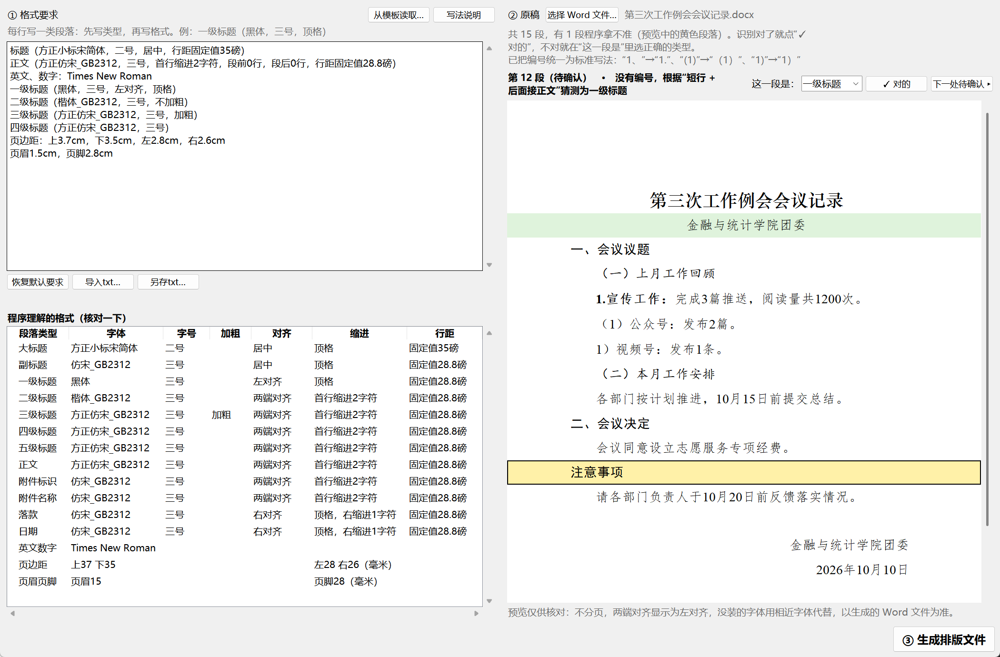

# gongwen-formatter 公文格式整理器

用文字写下格式要求，再选择一份格式混乱的 Word 原稿，程序会按要求自动排好版，输出一份新文件。原稿不会被修改。



## 使用方法

1. **写格式要求**：也可以点“从模板读取…”，选一份已经排好版的公文，程序会读出它每类段落的字体、字号、行距、缩进和页边距，自动写成格式要求，填进输入框供你核对修改。模板里格式不统一的地方会用 # 开头的说明行标出。
   手动写时，每行写一类段落，格式是“段落类型 + 格式”。默认已经填好规范要求，可以直接改。下方表格会实时显示程序理解成了什么，看不懂的部分会用红字标出来，不会悄悄忽略。
2. **选择原稿**（.docx）：右侧只列出程序拿不准的段落（黄色卡片），每张卡片显示这段文字和它的上一段。识别对了就点“✓ 对的”，不对就在“这一段是”下拉框里选正确的类型，卡片会变成绿色。如果发现其他段落也排错了，勾选“显示全部段落”即可修改。
3. **生成排版文件**：默认保存为“原稿名_已排版.docx”。

格式要求会自动保存，下次打开时还在。也可以用“另存txt…”把当前要求保存成文本文件备份。

### 格式要求的写法

```
标题（方正小标宋_GBK，二号，居中）
正文（仿宋_GB2312，三号，英文、数字Times New Roman）首行缩进2字符，行距固定值28磅，两端对齐
一级标题（黑体，三号，顶格）
二级标题：楷体_GB2312 三号 加粗 首行缩进2字符
页边距：上37毫米，下35毫米，左28毫米，右26毫米
```

| 可写的项目 | 例子 |
|---|---|
| 段落类型 | 标题、副标题、一级标题、二级标题、三级标题、正文、附件、附件名称、落款、日期 |
| 字体 | 仿宋_GB2312、方正小标宋_GBK、黑体、楷体_GB2312、宋体…… |
| 字号 | 二号、三号、小四……，或 16磅 |
| 加粗 | 加粗 / 不加粗 |
| 对齐 | 居中、两端对齐、左对齐、右对齐 |
| 缩进 | 首行缩进2字符、顶格、右缩进1字符 |
| 行距 | 行距固定值28磅、1.5倍行距、单倍行距；段前0.5行、段后6磅 |
| 西文字体 | 英文、数字：Times New Roman |
| 页边距 | 上37毫米，下35毫米，左28毫米，右26毫米（也可以用厘米） |

没有写到的段落类型会沿用正文的字体、字号和行距。

### 自动识别规则

| 原稿里的样子 | 识别为 |
|---|---|
| 第一段 | 标题 |
| 第二段较短、不以标点结尾 | 副标题（需要确认） |
| 一、 二、 | 一级标题 |
| （一） （二） | 二级标题（如果标题和正文在同一段，只有标题部分使用二级标题格式） |
| 1. 2. | 三级标题（只加粗到冒号；没有冒号时只加粗编号） |
| 没有编号的短行，后面接正文 | 一级标题（需要确认） |
| 附件： 及其下面的 1. 2. | 附件、附件名称 |
| xxxx年xx月xx日 及其上方的短行 | 日期、落款 |

另外，程序会删除多余的空行和行首空格，并在附件前、落款前各留一个空行。

## 下载安装

到 [Releases](../../releases) 下载“公文格式整理器-安装包-x.y.z.exe”，双击安装即可，不需要管理员权限。安装后桌面上会出现“公文格式整理器”快捷方式。

**字体**：程序使用的字体需要提前安装在电脑上，例如方正小标宋_GBK、仿宋_GB2312、楷体_GB2312。如果缺少字体，界面会给出提示。方正字体是商业字体，本项目不附带字体文件。

## 当前限制

- 只支持 .docx 格式，.doc 和 .wps 需要先另存为 .docx
- 原稿中的图片会被跳过；表格原样保留，不调整格式
- Word 自动编号生成的“一、”“1.”无法识别，程序会给出提醒

## 开发

```bash
pip install -e ".[dev]"
pytest                 # 运行测试
python app.py          # 打开图形界面
gongwen-fmt 原稿.docx -r 要求.txt --check   # 命令行版
build.bat              # Windows 本地打包
```

推送 `v*` 格式的 tag（如 `v0.2.0`）后，GitHub Actions 会自动在 Windows 上测试、打包，并把安装包发布到 Releases。

## License

MIT
